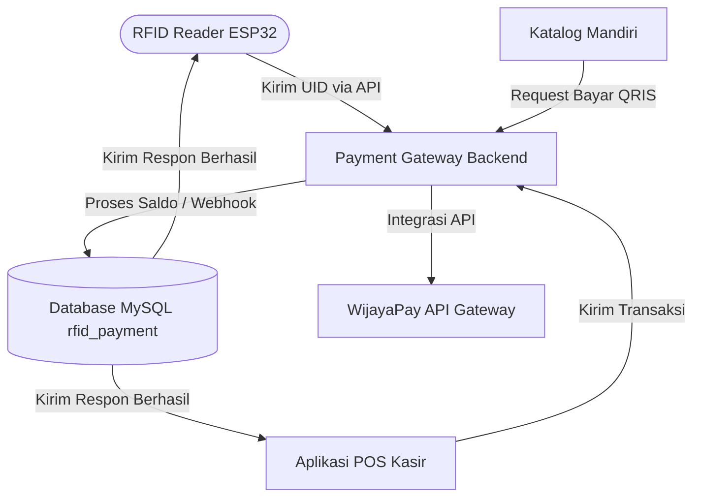

# 💳 RFID & QRIS Closed-Loop Payment Gateway

Sistem payment gateway mandiri (*self-hosted*) untuk pembayaran RFID tertutup (*closed-loop*), pengisian saldo (*top-up*), dan integrasi Point of Sale (POS) dengan desain dasbor premium bertema gelap (*glassmorphism dark UI*).

---

## 📌 Alur Integrasi Sistem

Aplikasi ini bertindak sebagai pemroses pusat transaksi (backend payment gateway). Aplikasi ini memproses ketukan (*tap*) kartu RFID dari pembaca fisik (ESP32/NodeMCU), memproses pembayaran QRIS/Virtual Account menggunakan **WijayaPay API**, dan menyimpan data pengguna/saldo.



---

## ⚡ Fitur Utama

- **💎 Dasbor Premium Glassmorphic Dark UI**
  - Tampilan dasbor modern bertema gelap dengan animasi gradasi radial.
  - Statistik dinamis, grafik tren transaksi, dan antarmuka responsif.
- **🎨 Branding Dinamis & White-Label**
  - Ubah nama aplikasi, logo, aksen warna, dan gradasi brand secara dinamis langsung dari pengaturan dasbor admin.
- **💰 Sistem Top-up Hibrida**
  - **Online Gateway**: Integrasi **WijayaPay API** untuk membuat QRIS dinamis, Virtual Account (BCA, Mandiri, BNI, BRI, BSI, dll), dan pembayaran retail (Alfamart/Indomaret).
  - **Manual Administrator**: Top-up saldo secara instan oleh admin dengan pencatatan log keterangan lengkap.
- **🤖 Integrasi Hardware RFID**
  - Menyediakan endpoint API aman untuk ESP32/NodeMCU atau USB RFID Reader untuk proses potong saldo (`tap_pay`) dan cek saldo (`tap_check`).
  - Dilengkapi keamanan otentikasi token API (`X-Api-Token`).
- **🏬 Arsitektur Fleksibel (Single & Multi-Tenant)**
  - Mendukung instalasi toko tunggal (*Single-Merchant*) maupun platform multi-bisnis (*Multi-Tenant SaaS*).

---

## 🏛️ Pilihan Arsitektur Deployment

Gateway ini mendukung dua model instalasi database:

1. **Single-Merchant Setup (Default)**
   - Cocok untuk satu toko, sekolah, kantin, atau lingkungan internal.
   - **Skrip SQL**: [`install.sql`](file:///mnt/samba-payment-gw/install.sql)
2. **Multi-Tenant SaaS Setup**
   - Mengizinkan banyak merchant terpisah mendaftar dan mengelola jaringan RFID mereka sendiri secara terisolasi menggunakan pembagian kolom `tenant_id`.
   - **Skrip SQL**: [`install_saas.sql`](file:///mnt/samba-payment-gw/install_saas.sql)
   - **Dokumentasi Detail**: Lihat berkas [`SAAS_GUIDE.md`](file:///mnt/samba-payment-gw/SAAS_GUIDE.md).

---

## 🚀 Panduan Instalasi & Setup

### 1. Kebutuhan Sistem
- PHP versi 8.0 atau lebih tinggi (ekstensi `PDO` dan `cURL` harus aktif).
- Server database MySQL / MariaDB.
- Server Web (Apache / Nginx) dengan modul rewrite aktif (`.htaccess` sudah disertakan).

### 2. Impor Skema Database
Buat database baru bernama `rfid_payment` di server database Anda, kemudian impor skema yang diinginkan:

```bash
# Untuk Setup Toko Tunggal (Single-Merchant):
mysql -u username_db -p rfid_payment < install.sql

# Untuk Setup Multi-Tenant SaaS:
mysql -u username_db -p rfid_payment < install_saas.sql
```

### 3. Konfigurasi Aplikasi (`config.php`)
1. Ubah nama file [`config.example.php`](file:///mnt/samba-payment-gw/config.example.php) menjadi `config.php`.
2. Buka file `config.php` dan sesuaikan parameter berikut:
```php
// Koneksi Database
define('DB_HOST', 'localhost');
define('DB_NAME', 'rfid_payment');
define('DB_USER', 'username_database_anda');
define('DB_PASS', 'password_database_anda');

// Token / Kunci Keamanan API untuk hardware reader. 
// Diisi bebas dengan kata sandi/kunci acak pilihan Anda (misal: 'KunciRahasiaRFID123!').
// Kunci ini harus sama dengan token yang dikirimkan oleh hardware RFID (ESP32) di programnya.
define('API_TOKEN', 'kunci-rahasia-api-pilihan-anda');

// Kredensial WijayaPay API (Ganti dengan akun merchant Anda)
define('WIJAYAPAY_MERCHANT_CODE', 'merchant-code-anda');
define('WIJAYAPAY_API_KEY', 'api-key-anda');
define('WIJAYAPAY_IS_PRODUCTION', false); // Ubah true jika live
```

---

## 📡 Dokumentasi API Hardware RFID & Keamanan PIN

Untuk meningkatkan aspek keamanan, sistem ini dilengkapi fitur **Validasi PIN 6 Digit**. Setiap kartu dapat diatur PIN-nya via Panel Admin (`pages/rfid.php`). 
- Jika kartu **memiliki PIN aktif**, setiap pembayaran/transaksi *wajib* menyertakan parameter `pin`.
- Jika kartu **belum memiliki PIN**, transaksi dapat dilakukan langsung (disarankan segera mengatur PIN demi keamanan).

Untuk menghubungkan hardware RFID Reader ke payment gateway, sertakan header `X-Api-Token` atau parameter query `?token=` dengan nilai `API_TOKEN` yang Anda tentukan di `config.php`.

### 1. Potong Saldo / Pembayaran RFID Tap
Kirim permintaan HTTP GET/POST saat kartu RFID ditempelkan ke alat pembaca:
```http
GET /api/rfid.php?action=tap&uid=A1B2C3D4&device=DEV-001&token=TOKEN_API_ANDA&pin=123456
```

**Respon JSON Sukses**:
```json
{
  "status": "success",
  "message": "Pembayaran berhasil",
  "nama": "Budi Santoso",
  "jumlah": 10000,
  "sisa_saldo": 36000,
  "order_id": "TAP-20260620-9948C55B"
}
```

**Respon JSON Error (PIN Salah - HTTP 401)**:
```json
{
  "status": "error",
  "message": "PIN salah"
}
```

**Respon JSON Error (PIN Wajib Diisi tetapi Kosong - HTTP 400)**:
```json
{
  "status": "error",
  "message": "PIN dibutuhkan",
  "pin_required": true
}
```

### 2. Cek Status Kartu & Saldo
```http
GET /api/rfid.php?action=check&uid=A1B2C3D4&token=TOKEN_API_ANDA
```
**Respon JSON**:
```json
{
  "status": "success",
  "nama": "Budi Santoso",
  "saldo": 51000,
  "kartu_status": "active"
}
```

---

## 🗺️ Peta Tabel Database

| Nama Tabel | Fungsi Utama | Cakupan Proyek |
| :--- | :--- | :--- |
| `users` | Menyimpan data pelanggan, kartu RFID (UID), status kartu, dan saldo. | Core Gateway |
| `transactions` | Log pencatatan audit transaksi top-up dan pembayaran merchant. | Core Gateway |
| `payment_methods` | Daftar bank/e-wallet pembayaran yang diaktifkan untuk transfer manual/otomatis. | Core Gateway |
| `topup_requests` | Pengajuan permintaan top-up manual dari pelanggan (bukti transfer). | Core Gateway |
| `devices` | Terminal RFID Reader fisik yang didaftarkan ke sistem beserta harga tap default. | Core Gateway |
| `rfid_logs` | Log aktivitas pembacaan kartu RFID (tap) untuk debugging & telemetri. | Core Gateway |
| `admins` | Akun pengelola payment gateway (Superadmin / Admin / Operator). | Core Gateway |
| `settings` | Pengaturan dinamis sistem (Branding warna, nama toko, min/max limit). | Core Gateway |
| `suppliers` | Daftar pemasok barang dagangan untuk inventory retail. | POS Client |
| `products` | Daftar inventaris barang retail (SKU, stok, harga beli, harga jual). | POS Client |
| `transaksi` & `transaksi_detail` | Transaksi struk belanja retail dari POS kasir. | POS Client |

---

## 📄 Lisensi
Proyek ini bersifat open-source dan berlisensi di bawah **MIT License**.
