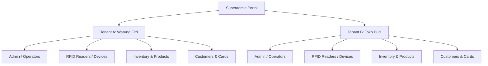

# RFID Closed-Loop SaaS Architecture Guide

This guide describes how the RFID Closed-Loop Payment Gateway and Point of Sales (POS) system can be configured as a multi-tenant Software-as-a-Service (SaaS) platform using logical isolation in a shared database schema.

---

## 🌟 Overview

By default, the core application operates as a single-merchant system. To scale this into a commercial SaaS platform (where multiple stores/merchants can register, configure their own card programs, connect their own RFID hardware readers, and sell their own products), we utilize the multi-tenant schema provided in `install_saas.sql`.

This architecture follows the **Shared Database, Shared Schema** design, separating tenant data logically using a `tenant_id` foreign key.



---

## 🛠️ Key Architectural Changes

### 1. The `tenants` Table
Acts as the root partition for all merchant accounts.
*   **`slug`**: Subdomain prefix (e.g., `fitri-cell` for `fitri-cell.platform.com`) used to resolve which tenant configuration to load dynamically.
*   **`status`**: State of the account (`active`, `suspended`, or `trial`).

### 2. Tenant Isolation
Every business-specific entity points to `tenants(id)` via `tenant_id`:
*   `users`, `devices`, `payment_methods`, `topup_requests`, `admins`, `settings`, `suppliers`, `products`, `purchase_orders`, `purchase_order_details`, and `transaksi`.

### 3. Unique Multi-Tenant Constraints
To prevent conflicts across different stores, several columns use compound unique keys:
*   **Admins**: `UNIQUE KEY (tenant_id, username)` – Different tenants can have admins with the name `admin` or `operator`.
*   **RFID Cards**: `UNIQUE KEY (tenant_id, rfid_uid)` – The same physical card (e.g., UID `A1B2C3D4`) can be registered in different merchant ecosystems with separate isolated balances.
*   **Inventory Products**: `UNIQUE KEY (tenant_id, sku_code)` – Distinct merchants can use the same SKU code for their items.
*   **Settings**: `UNIQUE KEY (tenant_id, key)` – Each store defines its own prices (e.g. `tap_price`), minimal topups, and names.

---

## 💻 Code Adaptation Patterns

To dynamically resolve the active tenant in PHP, we look at the subdomain or context:

```php
// Dynamic Tenant Resolution (e.g., in config.php)
function getActiveTenantId() {
    static $tenantId = null;
    if ($tenantId === null) {
        $host = $_SERVER['HTTP_HOST'] ?? '';
        $parts = explode('.', $host);
        
        // Resolve from subdomain (e.g., fitri-lopet.pay.com)
        $subdomain = count($parts) > 2 ? $parts[0] : 'default';
        
        $pdo = getDB();
        $stmt = $pdo->prepare("SELECT id FROM tenants WHERE slug = ? AND status = 'active'");
        $stmt->execute([$subdomain]);
        $tenantId = $stmt->fetchColumn() ?: 1; // Fallback to default tenant
    }
    return $tenantId;
}
```

Then, always append `tenant_id` filter to SQL queries:

```php
// Example: Checking customer card balance
$tenantId = getActiveTenantId();
$stmt = $pdo->prepare("SELECT nama, saldo FROM users WHERE tenant_id = ? AND rfid_uid = ?");
$stmt->execute([$tenantId, $rfidUid]);
```

---

## 🚀 Quick Start for SaaS Deployment

1.  Create the database using the SaaS-enabled schema:
    ```bash
    mysql -u username -p < install_saas.sql
    ```
2.  Route traffic to support wildcard subdomains (e.g., `*.yourdomain.com`).
3.  Configure your environment parameters using `getActiveTenantId()` to resolve dynamic tenant settings automatically.
